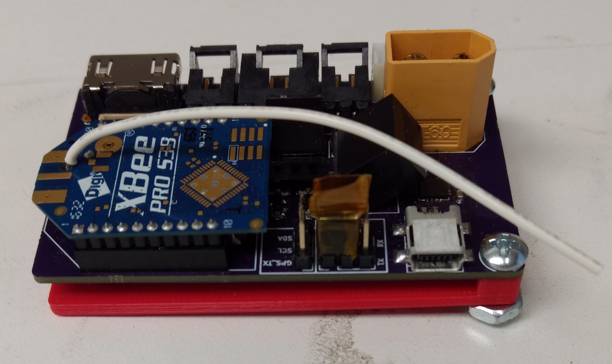

# Aerostat Control System #
Remote control system of Tetracam RGB+3 Multispectral camera

## Funcions currently implemented ##
- GPS parsing
- Timer based picture taking with settings via EEPROM
- General control over power of attached devices
- RGB+3 diagnostic mode auto-exit

## Functions needed to be implemented ##
- Low battery cuttoff
- Power modes?
- GPS power control on timer like camera
